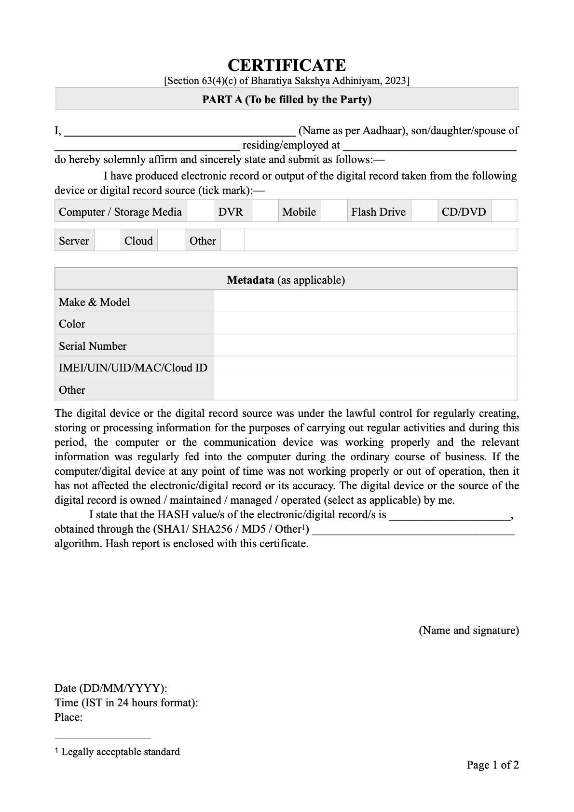
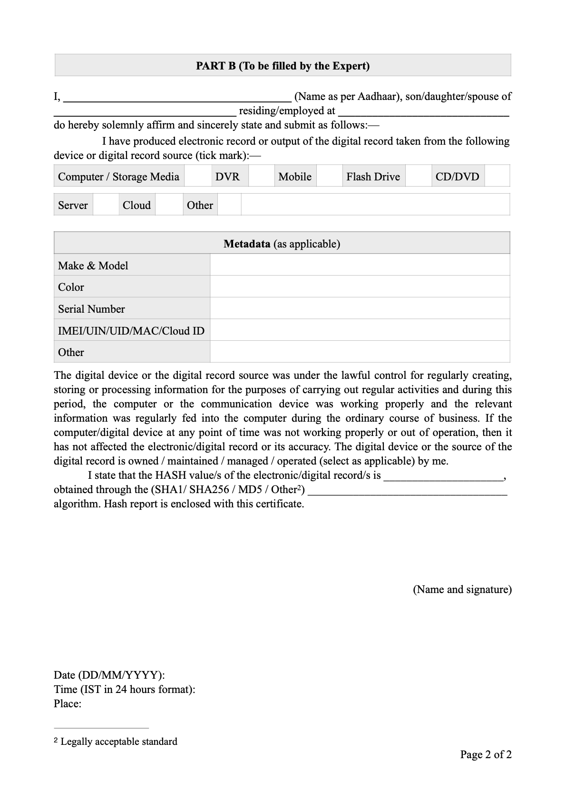

---
hide:
    - toc
    - navigation
description: The Schedule
---

???+ note
    The **style** and **formatting** of the certificate template or sample on this page are not exactly the same as those on Bharatiya Sakshya Adhiniyam, 2023.

    You can also download the certificate template in other formats for your reference:

    [:simple-adobeacrobatreader: PDF](../assets/certificate-samples/BSA-Section-63-4-C-Certificate.pdf){:target="_blank" .md-button .md-button--primary }
    [:material-apple: Pages](../assets/certificate-samples/BSA-Section-63-4-C-Certificate.pages){:target="_blank"  .md-button .md-button--primary }

|      |                          |
| :-----------: | :------------------------------------: |
|  |  |

<!-- You can also download the certificate template other formats for your reference:

[:simple-adobeacrobatreader: PDF](../assets/certificate-samples/BSA-Section-63-4-C-Certificate.pdf){:target="_blank" .md-button .md-button--primary }
[:material-apple: Pages](../assets/certificate-samples/BSA-Section-63-4-C-Certificate.pages){:target="_blank"  .md-button .md-button--primary } -->

